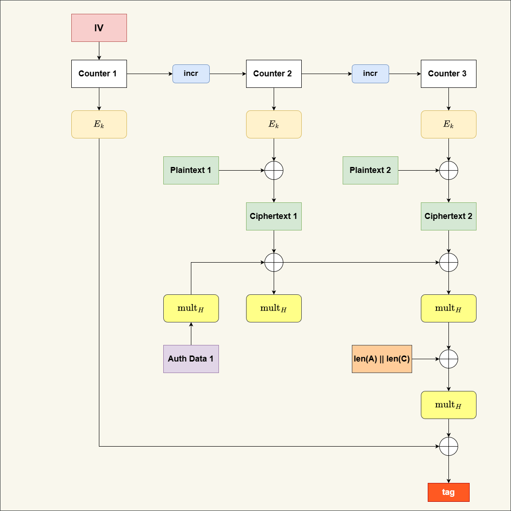
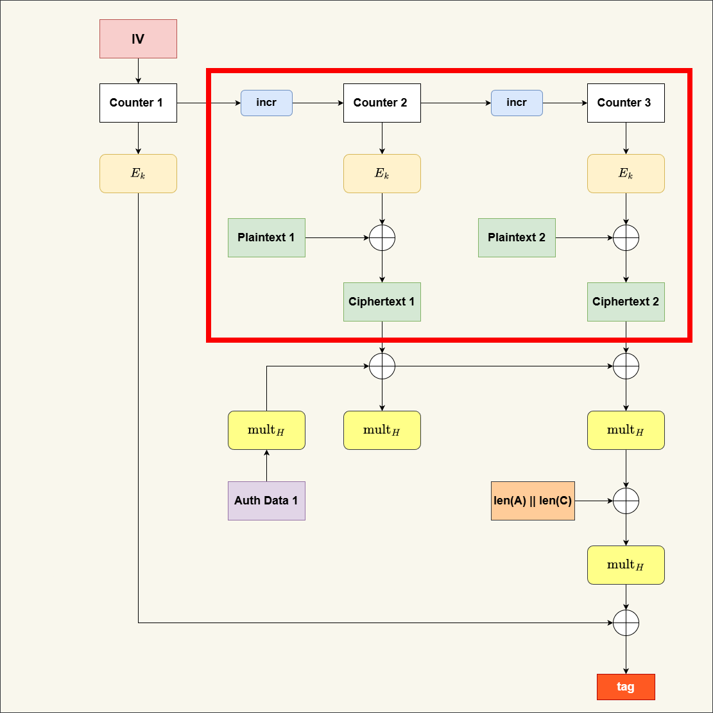
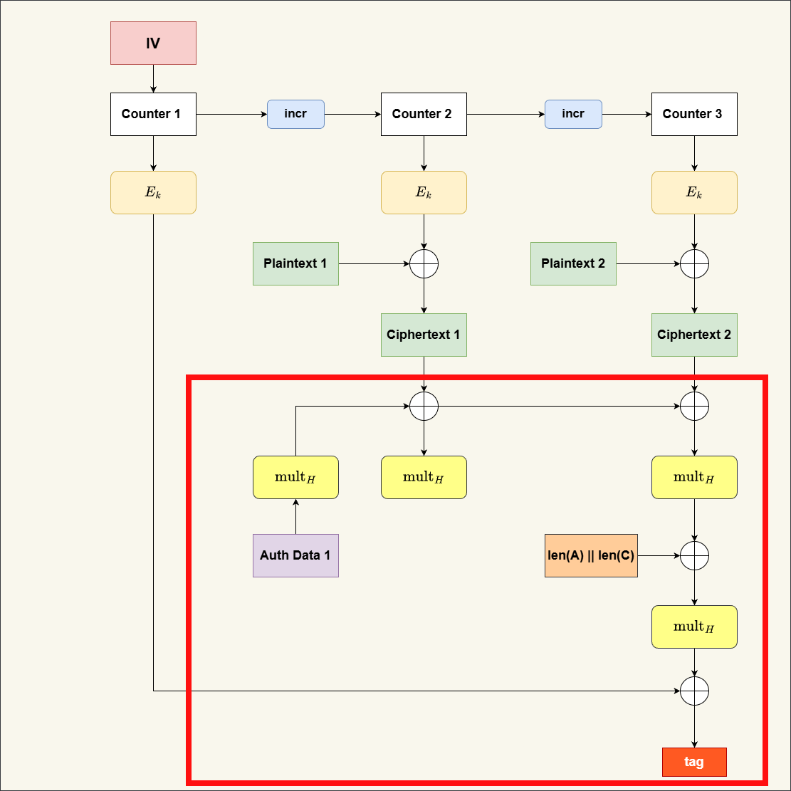
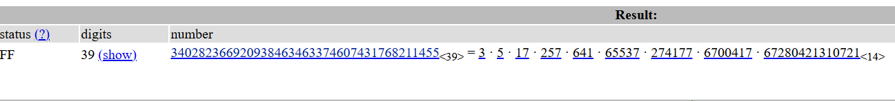


## Introduction

**AES-GCM** (Galois/Counter Mode) is currently one of the most widely used authenticated encryption algorithms. By combining the AES block cipher with the GCM mode of operation, it provides two critical security properties simultaneously: **confidentiality** (keeping data secret) and **data integrity** (ensuring data hasn't been tampered with). 

This dual functionality help GCM reduce the cost on both performance and implementation complexity because the data path processing in one go.

However, despite its popularity, AES-GCM is not without its flaws. In recent years, researchers have uncovered several weaknesses and attack vectors, such as the [*Forbidden Attack*](https://eprint.iacr.org/2016/475.pdf) or the [*Invisible Salamander*](https://keymaterial.net/2020/09/07/invisible-salamanders-in-aes-gcm-siv/). Among these interesting vulnerabilities is the **Cyclic Attack**, which targets specific "weak keys" in the GCM structure.



In this post, I will introduce the AES-GCM mode of operation, explain the concept of weak keys, and then walk through the mechanics of the Cyclic Attack. Finally, there will be a challenge and solution section for readers to test their understanding of the material.

For those interested in the deep technical details, the original research paper for this attack can be found here: [Weak Keys in the GCM Mode of Operation (Saarinen, 2011)](https://eprint.iacr.org/2011/202.pdf).

## Overview of AES-GCM

As mentioned earlier, AES-GCM serves two main purposes: encryption and authentication.

<figure style="text-align: center; margin: 20px 0;">
  
  <figcaption style="color: #ffffff; font-style: italic; margin-top: 10px;">
    Figure 1: Galois/Counter Mode (GCM) Encryption Operation <br>
  </figcaption>
</figure>

### 1. GCM Encryption

GCM encryption is based on the [**Counter (CTR) mode**](https://en.wikipedia.org/wiki/Block_cipher_mode_of_operation#Counter_(CTR)) of operation. In CTR mode, a unique counter value is generated for each block of plaintext data. This counter is then combined with the initialization vector and then encrypted using the AES block cipher to produce a keystream block. The plaintext block is XORed with this keystream block to produce the ciphertext block.

<figure style="text-align: center; margin: 20px 0;">
  
  <figcaption style="color: #ffffff; font-style: italic; margin-top: 10px;">
    Figure 2: AES-GCM encryption operation <br>
  </figcaption>
</figure>

The encryption and decryption of GCM using CTR: 

```python
from Crypto.Cipher import AES
from Crypto.Random import get_random_bytes

def encrypt_ctr(key, nonce, plaintext):
    cipher = AES.new(key, AES.MODE_CTR, nonce=nonce)
    return cipher.encrypt(plaintext)

def decrypt_ctr(key, nonce, ciphertext):
    cipher = AES.new(key, AES.MODE_CTR, nonce=nonce)
    return cipher.decrypt(ciphertext)

key = get_random_bytes(32)
nonce = get_random_bytes(12)
data = b"Hello, World!"

encrypted_data = encrypt_ctr(key, nonce, data)
print("Encrypted:", encrypted_data)
decrypted_data = decrypt_ctr(key, nonce, encrypted_data)
print("Decrypted:", decrypted_data)
# Encrypted: b'\xe7\xc4\x9e\xad\x0b\x90\xc3\x8a\xd9\x88\xf0\xd5\x08'
# Decrypted: b'Hello, World!'
```

### 2. GCM Authentication

Next, the functionality that make GCM special compared to other modes is its authentication mechanism. GCM uses a polynomial-based hash function called **GHASH** to compute an authentication tag over both the ciphertext and any additional authenticated data (AAD). This tag is then appended to the ciphertext to ensure data integrity.

The GHASH function processes in the Galois field \(GF(2^{128})\) using the hash key H and combines the AAD, ciphertext, and length blocks to produce the authentication tag. Before we learn how about GHASH works, we need to understand a bit about Galois fields.

#### Extension Field GF(2^128)

A Galois field \(GF(2^{n})\) is a finite field with \(2^{n}\) elements. In the case of \(GF(2^{128})\), we are working with polynomials of degree less than 128 with coefficients in \(GF(2)\) (i.e., binary coefficients 0 or 1). The operations in this field are defined as follows:

  - **Addition:** Addition is performed using bitwise XOR. For example, if we have two polynomials \(A(x)\) and \(B(x)\), their sum \(C(x) = A(x) + B(x)\) is computed by XORing their coefficients.

  - **Multiplication:** Multiplication is more complex and involves polynomial multiplication followed by reduction modulo an irreducible polynomial of degree 128. In AES-GCM, the chosen irreducible polynomial is:
    $$P(x) = x^{128} + x^7 + x^2 + x + 1$$
  
Here is the implementation of addition and multiplication in \(GF(2^{128})\):

```python

def galois_addition(a: bytes, b: bytes) -> bytes:
    """Perform addition in GF(2^128) using bitwise XOR."""
    return bytes(x ^ y for x, y in zip(a, b))

def galois_multiplication(x: bytes, y: bytes) -> bytes:
    """Perform multiplication in GF(2^128)."""
    R = 0xe1000000000000000000000000000000  # Reduction polynomial
    x_int = int.from_bytes(x, byteorder='big')
    y_int = int.from_bytes(y, byteorder='big')
    z_int = 0
    for i in range(128):
        if (y_int >> (127 - i)) & 1:
            z_int ^= x_int
        if x_int & 1:
            x_int = (x_int >> 1) ^ R
        else:
            x_int >>= 1
    return z_int.to_bytes(16, byteorder='big')

# Example usage:
a = bytes.fromhex('57831a2b3c4d5e6f708192a3b4c5d6e7')
b = bytes.fromhex('1f2e3d4c5b6a798897a6b5c4d3e2f100')
sum_result = galois_addition(a, b)
prod_result = galois_multiplication(a, b)
print("Addition Result:", sum_result.hex())
print("Multiplication Result:", prod_result.hex())

# Addition Result: 48ad2767672727e7e7272767672727e7
# Multiplication Result: 7d3a7f2b4a737a874d6401dd34850477
```
#### GHASH Function

After understanding the Galois field operations, we can now implement the GHASH function:

<figure style="text-align: center; margin: 20px 0;">
  
  <figcaption style="color: #ffffff; font-style: italic; margin-top: 10px;">
    Figure 3: GHASH calculation in AES-GCM <br>
  </figcaption>
</figure>

To compute the GHASH, we need the following components:

- 1. **Hash Key (H):** This is derived by encrypting a zero block with the AES key.
```python
from Crypto.Cipher import AES
key = get_random_bytes(16)  # AES-128 key
cipher = AES.new(key, AES.MODE_ECB)
H = cipher.encrypt(b'\x00' * 16)
print("Hash Key H:", H.hex())
```
- 2. **Data Blocks:** The AAD and ciphertext are divided into 16-byte blocks. If the last block is less than 16 bytes, it is padded with zeros.
- 3. **Length Block:** A 16-byte block that contains the lengths of the AAD and ciphertext in bits.
```python
length_block = ((8 * len_aad) << 64) | (8 * len_ct)
```

Now consider \(C_i\) as the \(i^{th}\) ciphertext block, \(A\) as the AAD block, \(L\) as the length block, and \(H\) as the hash key,\(T\) is the constant term that combines the IV with the counter 1 (that why we start at 2 in encryption process). The GHASH is computed as follows in \(GF(2^{128})\):
$$GHASH(H,C,T) =A . H^{n+1} + C_{0} . H^{n} + ... + C_{n-1} . H + T$$ 

Below is the encryption and decryption process in python:

```python
from Crypto.Cipher import AES
from Crypto.Random import get_random_bytes

key = get_random_bytes(16)  # AES-128 key
iv = get_random_bytes(12)   # 96-bit IV
gcm = AES.new(key, AES.MODE_GCM, nonce=iv)

data = b"Secret Message"
aad = b"Additional Data"
gcm.update(aad)
ciphertext, tag = gcm.encrypt_and_digest(data)
print("Ciphertext:", ciphertext.hex())
print("Tag:", tag.hex())

gcm_dec = AES.new(key, AES.MODE_GCM, nonce=iv)
gcm_dec.update(aad)
decrypted_data = gcm_dec.decrypt_and_verify(ciphertext, tag) # if tag is incorrect, it raises ValueError
print("Decrypted Data:", decrypted_data)
```

## The Cyclic Attack toward AES-GCM

The authentication key \(H\) in AES-GCM is also being an attack target if it is a "weak key". Now, let explore when \(H\) is a weak key and how the cyclic attack works.

### 1. The order of GF(2^128) and Lagrange's Theorem

\(\lvert GF(2^{128})^{\times} \rvert = 2^{128} - 1\)

The multiplicative group of non-zero elements in \(GF(2^{128})\) has order \(2^{128} - 1\). According to Lagrange's theorem:
> *The order of any subgroup divides the order of the group.*
- Now let factor the order of the \(GF(2^{128})\) to see all the subgroup orders:
<figure style="text-align: center; margin: 20px 0;">
  
  <figcaption style="color: #ffffff; font-style: italic; margin-top: 10px;">
    Figure 4: Factorization of the order of GF(\(2^{128}\)) <br>
  </figcaption>
</figure>

As we can see, the factorization contains several small prime factors, such as 3, 5, 17. This means that there exist a small order subgroups in \(GF(2^{128})\). Now, let figure out how these subgroup orders can lead to weak keys.

### 2. H = 0 (the all-zero key)

The simplest weak key is when \(H = 0\). In this case, the GHASH function simplifies significantly:
$$GHASH(0,C,T) = T$$
So in this case, the authentication tag only depends on the length block \(T\), which is predictable. An attacker can easily forge valid tags for any ciphertext by computing the correct length block.

**[POC]**:
```python
from GCM import AES_GCM
import os
from Crypto.Util.number import bytes_to_long

iv = os.urandom(16)
key = os.urandom(16)
aad = "aad_data"
plaintext = b"Secret Message"

auth_key = 0
aes = AES_GCM(bytes_to_long(key), auth_key)
ciphertext, tag = aes.encrypt(bytes_to_long(iv[:12]), plaintext,aad.encode())
print("Ciphertext:", ciphertext)
print("Tag:", tag)
#Ciphertext: b'\xb9\x91i\xaak\xa8\xb8\x13\xe1^\x7f\xf8\xb7\xb8'
#Tag: 16190581507654641172935509210608546348

ciphertext = os.urandom(len(plaintext)) # Random ciphertext
try:
    decrypted = aes.decrypt(bytes_to_long(iv[:12]), ciphertext, tag, aad.encode())
    print("Success:", decrypted)
except Exception as e:
    print("Decryption failed:", str(e))
#Success: b'\x05\x9d\xbb-\xb9vGrGU\nT\xfa\xcc'
```

### 3. H is the indentity element (order 1)

The indentity element in \(GF(2^{128})\) is: 
$$I =  80 00 00 00 00 00 00 00 00 00 00 00 00 00 00 00$$

So if H = I, then the GHASH function becomes:
$$GHASH(H,C,T) =A . I^{n+1} + C_{0} . I^{n} + ... + C_{n-1} . I + T$$ 

Since multiplying by the identity element does not change the value, we have:
$$GHASH(H,C,T) =A + C_{0} + ... + C_{n-1} + T$$

This means if we swap the position of any two ciphertext blocks, the GHASH value remains unchanged. An attacker can exploit this property to create valid forgeries by rearranging ciphertext blocks.

**[POC]**:
```python
from GCM import AES_GCM
import os
from Crypto.Util.number import bytes_to_long
from random import shuffle
iv = os.urandom(16)
key = os.urandom(16)
aad = "aad_data"
plaintext = os.urandom(16*3)

auth_key = 0x80000000000000000000000000000000  # Indentity element in GF(2^128)
aes = AES_GCM(bytes_to_long(key), auth_key)
ciphertext, tag = aes.encrypt(bytes_to_long(iv[:12]), plaintext,aad.encode())
print("Ciphertext:", ciphertext)
print("Tag:", tag)
# Ciphertext: b'\xc8\xbf\x10\xb0\x85\xb4\x92\xad\x8a\xb9\xa2\x13XM\xf9JVz\x88\xf9}\xf1\x02\x82\xa9\xde\x83\x11\x91\r\xca\xde\xd2\xd8\xd8\xbd\xd8\xee\x96\xf8\x8c\x1e\x8f\x06\xc8\x12SO'
# Tag: 234670642862138274263302034330249939930

ciphertext = [ciphertext[i:i+16] for i in range(0, len(ciphertext), 16)]
shuffle(ciphertext) # Shuffle the ciphertext blocks
ciphertext = b''.join(ciphertext)
try:
    decrypted = aes.decrypt(bytes_to_long(iv[:12]), ciphertext, tag, aad.encode())
    print("Success:", decrypted)
except Exception as e:
    print("Decryption failed:", str(e))
# Success: b'<\xc7\x1bX\x01\xad\x93\xea\xd1\xc9\xc0\n\xc7\xfd\x8c:\xc1\xbc2a_\x9c>#`\x97\x93\xf9\xba=\xa5D\xfa[\x98\xdb\x9aS\xc7s\x01bl\xf9\x91\x84\x97j'
```
### 4. H lies in a small order subgroup (3,5,17)

So far, we have seen weak keys with orders 0 and 1. Now, let's explore weak keys with small orders like 3, 5, and 17. If H has the order of \(d\), then \(H^d = I\). This property can be exploited in the GHASH computation. For example, if H has order 3, then:
$$GHASH(H,C,T) =A . H^{n+1} + C_{0} . H^{n} + ... + C_{n-1} . H + T$$
We can group the terms based on their exponents modulo 3:
$$GHASH(H,C,T) = (A + C_{3k} + ...) . H^{0} + (C_{3k+1} + ...) . H^{1} + (C_{3k+2} + ...) . H^{2} + T$$
This means that by rearranging the ciphertext blocks in a way that preserves these groupings, an attacker can create valid forgeries.
First we can find a weak key with order n with the following code:

```python
F.<x> = GF(2^128)
print((F.gen() ^ ((2^128 - 1) // int(input()))).integer_representation())
```
Then, we can use the weak key to perform the cyclic attack:

**[POC]**:
```python
from GCM import AES_GCM
import os
from Crypto.Util.number import bytes_to_long
 

 
iv = os.urandom(16)
key = os.urandom(16)
aad = "aad_data"
plaintext = os.urandom(16*20)

auth_key = 0x10D04D25F93556E69F58CE2F8D035A94 # element of order 3 in GF(2^128)
aes = AES_GCM(bytes_to_long(key), auth_key)
ciphertext, tag = aes.encrypt(bytes_to_long(iv[:12]), plaintext,aad.encode())
print("Ciphertext:", ciphertext)
print("Tag:", tag)

#Ciphertext: b'\x16,\t\xfc\xe5EZ=\xd2\xa5}\x8drr\x08\x1d\xad\t\xce\xc5c\x11\x95K\xe1\x92\x8c\x06J\x107P\xab\x7f\xb0J\xd51\xcbz\x92\xe1\xd7_\x0fkJ(\x1fX9\xef-s\x15\xa7\xe5\x0fG{\xaf\xdc\xdd.\xa08\xd6@\n\xe4\x15\xa0u\xa5W\xa4 `$\x17\xbe\n}\x94A\xdb\xcar?-\x89\x10\x02Dk\xe8?\xad\xb19=N\x0f\xfaW\x90\xa8\xc9;\xb3\x1b\xbc\xe4\xc9\x15\xcd1\xb8!RD\xac\xbb\xa4\xea\x00\xac\x95#\xefH\x06"K\x05\x90\xce<0\x06\xad\xff\xbaA\xfb\xae\x99m\x12\x92x\x89;\x83\x18\xb6\xf8E \xf9\xa0\xc7\xe3\xc71\xd8\xfbj\xe4\x9c@\x1e\x88\xc0\xbd\xa8\xd5\xec\xecx~\x03\x81\xef\x1a\xefV\xba\xfd\xee\xc8\xff\x81i~gf\\#\xed\x7f\xdf \xa9*\xc5\xbeR\xc0\xe6\xecC\xe6\xef\xf0\x9at\x8a\x96\x0e;:\xdfw?\x1e\x83\xd7[\xd4\x98\x83\x12\x9f\xady\xf8\n\xe4\xb9r\xbc%\x90\xaa`\xaf\xb0\x14\xde\x0f|>6\xea\x96\xf4\x83\x0e\x81\x19\xd9c\xeb5Q_\x03NvfmM\x95\xd5\xef5\xeb\xe4\xa1Z\x00"\xaa3\xda\x81j\xdd\x14\xbd\xd5\x0e*dh"\xc8\x90\xfe\xb2s7D\xc8\xbfg-\xbb\x19\xe4\xc4\x12\xb3"5\x0b&\x05U'
#Tag: 75312061261792169459637214576592028036

#Perform the swapping block
ciphertext = bytearray(ciphertext)
offset = 3 * 16
idx_last = len(ciphertext) - 16
idx_target = idx_last - offset

block_last = ciphertext[idx_last : idx_last + 16]
block_target = ciphertext[idx_target : idx_target + 16] 
ciphertext[len(ciphertext) - 16 : len(ciphertext)] = block_target
ciphertext[idx_target : idx_target + 16] = block_last

try:
    decrypted = aes.decrypt(bytes_to_long(iv[:12]), ciphertext, tag, aad.encode())
    print("Success:", decrypted)
except Exception as e:
    print("Decryption failed:", str(e))
# Success: b'\x8e\xc1w\xa5\xdd]\x13}\xe9\xf8\xbc\x93CI\xb0 14\x1er\xdbe_f5\x1e@,z\xf7\xa3\xdb(\x16\x13\xb2\xf7\x81\xda:\xe2\xbcf\x97\x12\xfe\'1O%\x11WN\tH\xc32)Y\x01\xd7jQ\x8e#V\x18E\xa4\xc0D\xc0\x05q\xa7\x1ak\xc9\xd4\xe6B\xdc2\xb3\x02N\x8d\x17\xa9]\x01"\x10\xf6\xc7\x03\xc5v{\x82\n3\x0f\xfdF6PG\x9f\xac\xde(R}\xca\xd7\xde\xa1X\x9c\xf4DMu\xact\xdc\x85\xd6\xde\xab\x19ND=\xc2\xa0W$\'*\x03\x0e\xd0\xce\xc7[\xc2\x11q\xb5\xce\xb2~o\');\xed\n\xce@{\xc7\xe6^\xb2\xab\xddFe\xef\xcb\xaeB\xbb\xce\xba\xc0\x1bk\x07\xf1T\x18\xf8\xd9\x1b\xff\xfc/\x8f\x86x\xef\xdf\xc3\xd5\x89@\x02\x8c\xa2\xea\xe8\xf7\xff\xf3\xe0\r\x8eB%6\xcd\x83\x9f\xad\xe7\xa8\xd4\x8d \xb3\x08\xad\x86\xe0\xd8\xcf\xa5\xdf\xe3@\x1b\x1b\xff}g}W\n\xdb\x12\xb9\xb8bA\xe4\xaa4\x92fa|\xd8\x8b\xcfO\x8ex\x08D\x14\xbe\xc93.^\xde\xeb\x1e4R^P\xeeSo\xd1\x02\xf7\r\x93x2\xa0\xf3D\xb4\xae\xb7!c?A\x10D\xae%\xb7\xb0dB\x83|\xeb)\x7f\x16\x08\xc2\xfc\x8b\xefYu\xacg\xa9'
```

## Conclusion

The Cyclic Attack on AES-GCM highlights the importance of key selection in cryptographic systems. Weak keys, particularly those with small orders in the Galois field, can lead to vulnerabilities that compromise both confidentiality and integrity. 

But it's important to note that although finding weak authentication key is easy, finding the corresponding AES key is still computationally infeasible with current technology. 

Therefore, AES-GCM remains secure for practical use when implemented with proper key management practices. But with the advancement of cryptanalysis techniques, the power of quantum computing, it worth taking this vulnerability seriously and maybe adding the addtional checks to avoid weak keys in future designs.

## References
- [Weak Keys in the GCM Mode of Operation (Saarinen, 2011)](https://eprint.iacr.org/2011/202.pdf)
- [Galois/Counter Mode](https://en.wikipedia.org/wiki/Galois/Counter_Mode)
- [Abstract Algebra: Theory and Applications](http://abstract.ups.edu/)
